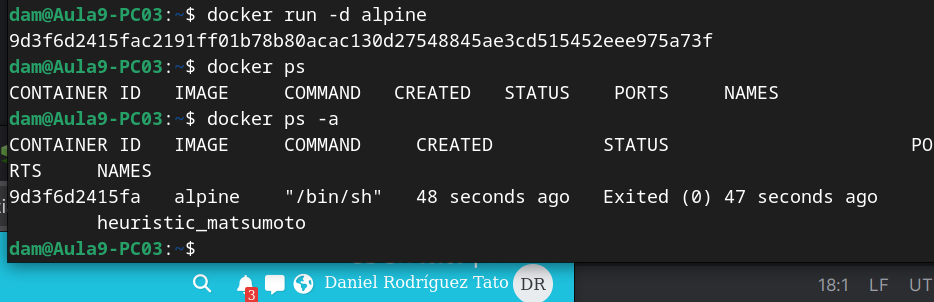

# Tarea03_SXE_Docker
Tarea 03 de SXE

1. Descarga la imagen "alpine" SIN ARRANCARLA y comprueba que está en tu equipo.

Comandos:

docker pull alpine descarga la imagen

docker images -- para mostrar las imagenes en el equipo

---

2. Crea un contenedor sin ponerle nombre. ¿está arrancado? Obtén el nombre

Comandos:
- docker run -d alpine para crearlo 
- No no está arrancada porque con docker ps no se muestra (muestra solo los contenedores activos)
- docker ps -a para mostrar todas. y asi consigo el nombre, que es aleatorio

---

